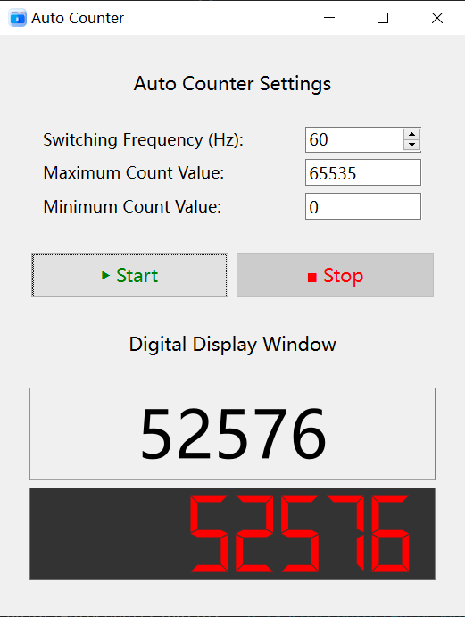

# Auto Counter
## How to use?
1. Set the jumping **Frequency** of the counter, with the range from 1 to 100. Default value: 25.
2. Set the **Maximum** and **Minimum** values that the counter can obtain. The default values are 1000 and 0 respectively.
3. Click the **Start** button to make the counter run. At startup, it will be initialized to the minimum. When the value is higher than the maximum, it will be reset to the minimum.
4. Click the **Stop** button when you want to stop the counter. The value will remain at the lastest statement when it stops.
 

## Contact me
You can contact me through ***Github Private Message***. The email address is not disclosed here because of privacy. Looking forward to hearing your better suggestions!

---

# Update Log
## Version 1.1 2025-08-15 16:45
**Now this application can be used normally!**
+ User input data validation is added.
+ Start-stop control and counting logic have been configured.
+ Some bugs were fixed and some UI designs were optimized.

## Initial Version 1.0 2025-08-15 10:50
There is no function available for the software now due to construction.
+ The basic UI design in `ui.cpp` is completed.
+ The primary architecture of the `mainwindow.cpp` is given, in which TODO list is listed.
